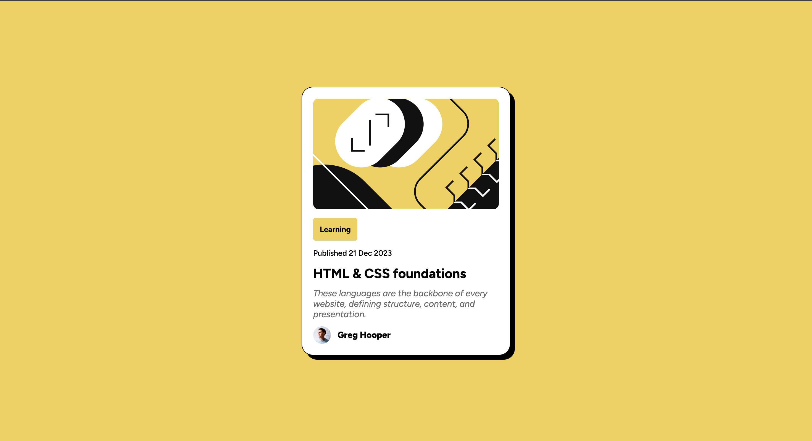
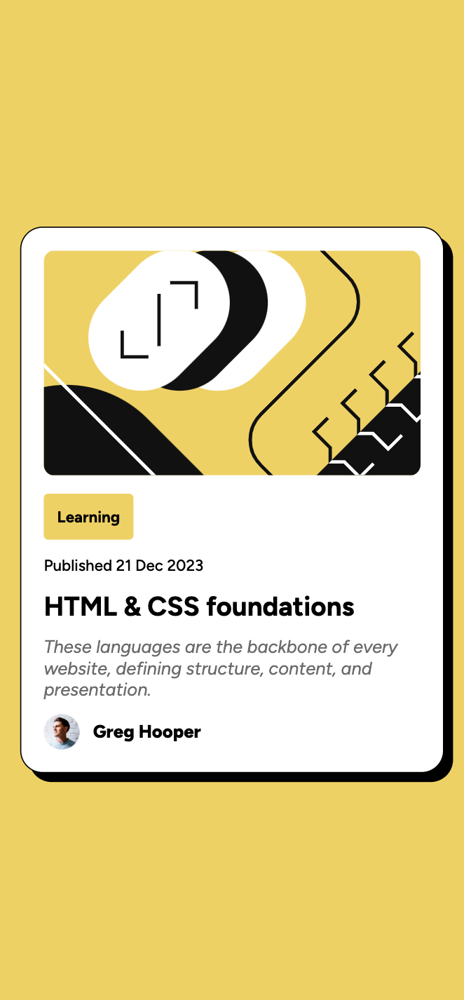

# Blog preview card

This is a solution to the Blog preview card challenge on Frontend Mentor [link](https://www.frontendmentor.io/challenges/blog-preview-card-ckPaj01IcS).

## Desktop Version



## Mobile Version



## My process

To create the layout, I started by centering the card in the viewport. This was achieved by applying Flexbox properties to the body element:

```
body {
    display: flex;
    justify-content: center;
    align-items: center;
}
```

This ensures the card remains centered both vertically and horizontally, regardless of screen size.

Next, I implemented the various styles based on the design specifications provided in the Figma file. This included:

- Defining custom fonts (Figtree and FigtreeItalic) for the overall typography.
- Adding padding, borders, and shadows to the card container to give it a distinct, modern appearance.
- Structuring the layout with Flexbox for the card’s content, ensuring a clean and responsive arrangement for the image, text, and profile details.
- Applying hover effects and font weights to highlight interactive elements, enhancing user experience.

By adhering closely to the design, I ensured the card reflects the intended look and feel outlined in the challenge.
